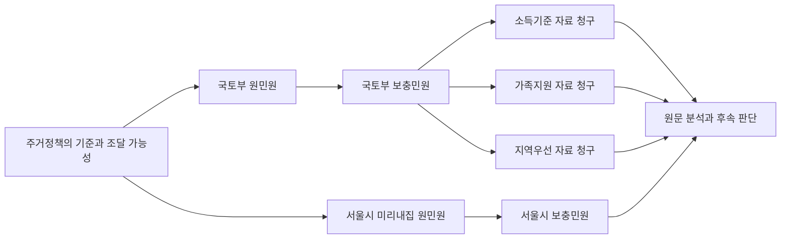

# 민원 추적과 제출 자동화

기준일: 2026년 10월 8일 KST

민원은 쟁점별로 연결하고, 제출 준비와 상태 확인을 같은 장부에서 처리한다. 가장 먼저 자동화할 작업은 **접수내역 확인, 원문 보관, 질문별 답변 대조, 다음 행동 정리**다. 제출할 때는 장부에서 기관·제목·본문·첨부를 가져와 computer use로 입력하고, 접수 결과를 다시 장부에 기록한다.

운영 목적은 불합리한 행정과 제도를 찾아 실제 개선까지 확인하는 것이다. 문제 선정, 근거 검증, 제출 경로와 해결 기준은 [대한민국 행정과 제도 개선을 위한 민원 전략](strategy.md)을 따른다.

입법과 행정의 추진 단계에서는 [시행 전 문제 탐지](early-warning.md)를 사용한다. 공개 계획·예고·발의·사업의 변경 내용과 의견 기한을 추적해 수정 요구를 준비한다. 자동 수집과 알림은 후속 구현 설계 단계다.

## 바로 열 문서

| 문서 | 내용 |
| --- | --- |
| [계정 입력과 원격 사용 준비](accounts-and-remote.md) | 사용자가 가입한 세 계정의 비공개 저장, 입력 명령과 원격 사용 조건 |
| [원격 실행 지침](remote-runbook.md) | 실행 Mac 확인, 비밀번호를 출력하지 않는 로딩과 로그인·접수의 완료 기준 |
| [민원 개선 전략](strategy.md) | 문제 발굴 기준, 현재 추적 범위, 우선순위, 제출 경로와 해결 확인 |
| [문제 발굴 조사 방법](discovery-research.md) | 공식 자료로 조사한 발굴 방법, 규칙 비교, 절차 측정과 검증 사례 |
| [입법·행정의 사전 탐지](early-warning.md) | 확정·집행 전 신호, 변경안 검토, 의견 기한과 예방 성과 |
| [사전 탐지 자료 목록](early-warning-sources.json) | 공개 경로별 확인 범위, 법률안 사례와 접근 제한 |
| [조사 자료 목록](discovery-sources.json) | 공식 자료 경로, 관찰 범위와 접근 제한 |
| [문제 후보 기록 양식](issue-candidate.example.md) | 문제 후보의 근거, 반대 근거, 비교 조건과 다음 행동 |
| [발굴 실행 지침](discovery-runbook.md) | 에이전트의 조사 순서, 근거 확인, 중복 후보 정리와 결과 기록 |
| [주거정책 민원 경과](../../data/complaints/housing-policy-history.md) | 공유 대화의 국토부 및 서울시 민원, 정보공개청구, 후속 판단 |
| [민원 추적 장부](../../data/complaints/board.md) | 현재 상태, 근거 수준, 접수번호, 다음 확인일 |
| [computer use 실행 지침](computer-use.md) | 포털별 진입 경로, 조회·작성·접수 확인, 중복 제출 복구 |
| [기관과 포털 목록](portals.json) | 공개 화면에서 확인한 메뉴와 URL |
| [새 사건 예시](case.example.json) | 새 민원 또는 정보공개청구 입력 형식 |
| [상태 갱신 예시](event.example.json) | 확인 결과를 덮어쓰지 않고 추가하는 형식 |

`data/complaints/`는 기존 `.gitignore` 규칙에 따라 Git에서 제외되는 로컬 자료다. 접수번호, 회신, 실제 제출 본문, 첨부 및 화면 캡처는 여기에 보관한다. 운영 코드와 익명 예시는 `tools/complaints/`에 둔다. Git 제외는 백업이 아니므로 이 자료는 별도 비공개 백업 대상이다.

## 시간을 줄이는 기능

| 우선순위 | 기능 | 줄어드는 반복 작업 |
| --- | --- | --- |
| 1 | 사건과 후속 절차 연결 | 원민원 번호와 과거 답변을 매번 찾는 작업 |
| 1 | 포털 상태 확인과 변경 기록 | 세 사이트를 열어 접수·이송·연장·답변을 확인하는 작업 |
| 1 | 질문별 답변 대조 | 긴 답변에서 자료명·검토 여부·미답변을 다시 찾는 작업 |
| 2 | 제출 묶음 생성 | 기관, 기간, 질문, 첨부, 수령방법을 다시 입력하는 작업 |
| 2 | 화면 입력과 접수증 보관 | 복사·붙여넣기와 접수번호 수동 기록 |
| 3 | 결과에 맞는 후속 초안 | 보충질의·정보공개청구·이의신청 초안 작성 |
| 3 | 재사용 지침 | 다음 사건에서 같은 흐름을 다시 설명하는 작업 |

추적 장부는 한 곳을 원본으로 삼는다. 스프레드시트나 업무관리 서비스가 필요해지면 장부의 보기로 연결한다. 처음부터 여러 서비스에 같은 상태를 수동으로 적지 않는다.

## 사건과 절차를 연결하는 방식

`issue_id`는 해결하려는 문제를, `case_id`는 실제 제출 절차 한 건을 식별한다. 원민원에 붙인 추가답변 요청과 만족도 평가는 그 사건의 활동으로 기록한다. 별도 접수번호를 받은 보충민원이나 정보공개청구는 새 사건으로 만들고 `parent_case_id`로 연결한다.



공유 대화에서 가져온 초기 사건은 7건이다. 국토부 정보공개청구 3건과 서울시 보충민원은 대화상 대기 상태이며, 국토부 원민원·보충민원과 서울시 원민원은 답변 수신 기록이 있다. 모두 포털 원문 대조 전이므로 `evidence_status=pending`으로 시작한다. 이미 접수됐다고 기록된 사건은 재제출 대상으로 삼지 않는다.

기존 별도 문서에는 공정위 정보공개청구 1건과 정비사업 관련 접수 3건이 더 있다. 이 4건은 아직 통합 장부에 없다. 찾아낸 접수 관련 기록은 총 11건이지만, 모든 계정의 제출 내역을 확인한 결과는 아니다. 최신 포털 상태와 정기 조회·알림 연결도 확인 전 또는 미구현 상태다. 과거 대기 기록을 현재 미회신으로 단정하지 않는다.

## 장부 사용

추가 설치 없이 Node 표준 라이브러리만 사용한다. 저장소 루트에서 실행한다.

```bash
node tools/complaints/tracker.mjs check
node tools/complaints/tracker.mjs board --as-of=2026-10-08 --write
node tools/complaints/tracker.mjs add --file=/absolute/path/new-case.json
node tools/complaints/tracker.mjs record --file=/absolute/path/observation.json
```

기록 명령의 검증은 `node --test tools/complaints/tracker.test.mjs`로 실행한다.

`cases.jsonl`에는 새 사건을 추가하고, `events.jsonl`에는 이후 변경을 추가한다. `record`는 같은 이벤트를 재실행해도 한 번만 기록한다. `board.md`는 두 입력 파일로부터 재생성한다. 동일한 포털 접수번호를 다른 사건에 중복 등록하거나 답변 수신 사건을 작성 준비 상태로 되돌리는 변경은 거부한다.

예시의 식별자·기관·본문·근거를 실제 값으로 바꾼 후 사용한다. 예시 파일 자체는 제출 데이터가 아니다. `--data-dir=/absolute/path`로 별도 장부를 사용할 수 있다.

## 상태와 근거

| 필드 | 의미 |
| --- | --- |
| `status` | draft, prepared, submission_unknown, submitted, waiting, response_received, hold, closed, cancelled |
| `resolution_status` | unknown, unresolved, resolved. 답변 수신만으로 resolved로 바꾸지 않는다 |
| `evidence_status` | pending, confirmed, conflict, context_only |
| `status_raw` | 포털에 표시된 상태 원문 |
| `receipt_number` | 신청자가 조회할 때 쓰는 포털 접수번호 |
| `agency_receipt_number` | 처리기관 내부 접수번호. 포털 접수번호와 별도 보관 |
| `submitted_on`과 `received_on` | 제출일과 기관 접수일을 구분 |
| `portal_due_on` | 포털 표시 처리예정일. 계산값으로 대체하지 않는다 |
| `decision_notified_on` | 정보공개 결정 통지를 받은 날 |
| `next_check_on` | 내부 점검일. 법정기한과 별도 |
| `source` | 확인 경로, 원문 위치, 관찰 시점 |
| `questions` | 질문 식별자·요청 내용·답변 여부·회신 근거 |
| `filing` | 제출할 제목·본문·기간·공개방법·수령방법·첨부 목록 |

`confirmed`는 포털에서 직접 확인한 기록이나 공식 문서의 로컬 증거 파일이 있어야 한다. 공유 대화의 사용자 인용과 이전 AI 요약은 그 출처를 보존하되, 공식 확인으로 승격하지 않는다. 포털이 다르게 표시하면 과거 이벤트를 유지하고 새 관찰을 추가한다.

## 기한 관리

정보공개법 제11조는 청구를 받은 날부터 10일 이내 공개 여부 결정과 부득이한 경우 10일 범위의 연장을 규정한다. 이는 자료 수령 완료일과 별도다. [정보공개법 제11조](https://www.law.go.kr/lsLinkCommonInfo.do?lsJoLnkSeq=1011235965)

공식 처리 안내에는 초일 산입, 토요일·공휴일 불산입이 명시되어 있다. 이번 장부는 법정기한을 자동 계산하지 않는다. 실제 기관 접수일, 포털 예정일, 연장 통지 및 한국 공휴일을 확인하지 않고 제출일에 10일을 더해 기한으로 표시하지 않는다. [전북특별자치도교육청 처리 절차](https://www.jbe.go.kr/open/index.jbe?menuCd=DOM_000001001001002000)

제18조는 비공개·부분공개 결정에 불복하거나 청구 후 20일이 지나도록 결정이 없는 경우의 이의신청과 30일 신청기간을 규정한다. 이의신청 결정은 원칙적으로 7일 이내이며 부득이한 경우 7일 범위의 연장이 가능하다. 실제 적용 날짜는 통지서와 기간 산정 기준을 대조한다. [정보공개법 제18조](https://www.law.go.kr/lsLinkCommonInfo.do?chrClsCd=010202&lsJoLnkSeq=1031228369)

## 제출용 묶음

computer use 실행 전에 한 사건의 제출 내용을 로컬에서 확정한다.

| 항목 | 필요한 내용 |
| --- | --- |
| 기관과 절차 | 목적에 맞는 기관, 일반민원·정보공개·이의신청 구분 |
| 제목과 본문 | 최종 문안, 문안 버전 또는 해시 |
| 질문 | 번호를 붙인 질문과 각 질문의 완료 조건 |
| 자료 청구 범위 | 보유자료 종류, 대상 기간, 관련 주제 |
| 이전 사건 | 원민원 번호, 답변 원문, 추가 요청의 이유 |
| 첨부 | 실제 경로, 파일명, 해시, 업로드 대상 |
| 수령과 공개 설정 | 전자파일, 정보통신망, 공개 여부 등 선택값 |
| 실행 권한 | 실제 기관·목적·전송 데이터가 특정된 사용자 지시 |

현재 정보공개 A·B·C 문안은 [경과 기록](../../data/complaints/housing-policy-history.md)에 보관했다. **대화에 제시된 문안**이며 포털에 실제 제출한 최종 본문과 동일하다고 단정하지 않는다. 다음 조회에서 청구서 원문과 대조한다.

민원사례 공개, 개인정보 비공개, 알림 수신, 개인정보 동의는 각 화면의 설명과 사용자의 선택을 확인한다. 이전 AI가 추천한 선택값을 모든 사건의 기본값으로 복제하지 않는다.

## 답변을 받으면

각 질문에 `answered`, `partial`, `unanswered`, `not_applicable` 중 하나와 해당 회신 문장 또는 원문 위치를 붙인다. 자료 존재와 검토 실시 여부도 구분한다.

| 결과 | 다음 검토 |
| --- | --- |
| 전부공개 | 문서와 질문을 연결하고 실제 분석 범위·가정·시점을 검토 |
| 부분공개 | 공개 자료를 먼저 분석하고 비공개 부분·근거조항을 검토 |
| 비공개 | 근거조항과 구체적 사유를 확인하고 이의신청 여부 판단 |
| 부존재 | 해당 기관·기간·청구 범위에서 보유하지 않는다는 기록으로 보존 |
| 이송 | 목적 기관과 새 접수번호·기한을 기록 |
| 민원 전환 | 전환 사유와 법적 근거, 새 사건·기한을 확인 |
| 설명 위주 답변 | 미답변 항목만 추려 보충질의 또는 기존 자료 청구 검토 |

부존재는 정책 전체에 분석이 전혀 없었다는 증거가 아니다. 정보공개법 제11조 제5항은 일정한 경우 민원 처리도 허용하므로, 전환 자체를 위법이나 회피로 분류하지 않는다. 기관의 사실 통지와 민원인의 평가는 별도 필드에 남긴다.

## 구현 순서와 완료 기준

1. **기록과 추적**: 이번 초기 장부와 append 방식 기록 명령을 사용한다. 다음 조회에서 실제 접수번호, 본문, 예정일, 회신 원문을 대조한다.
2. **조회 자동화**: 세 포털에서 대상 사건을 조회하고 변경분을 기록한다. 신규 답변·이송·연장·기한 임박·인증 필요 때만 알림을 내도록 한다.
3. **제출 준비와 입력**: 제출 묶음 생성 후 한 사건으로 기관·본문·첨부 대조를 검증한다. 접수 성공 화면과 번호를 확인해야 submitted로 기록한다.
4. **후속 초안**: 질문별 답변 대조로 다음 절차와 초안을 만들고 원민원에 연결한다. 새 외부 제출은 해당 내용에 대한 실행 지시가 있어야 한다.

현재 완료 범위는 민원 개선 전략, 로컬 기록·추적 명령, 사용자 계정 입력 도구와 computer use 실행 지침이다. 세 계정의 값은 아직 입력 전이며, 로그인 이후 조회, 실제 폼 입력·접수, 반복 실행 일정은 아직 연결하지 않았다. 첫 실행은 **기존 11건의 기록 대조와 포털 원문 확보**로 잡는다. 통합 장부에는 7건만 등록돼 있다. 현재 장부는 정보공개포털·국민신문고·서울시 응답소를 지원한다. 송파구 새올 사건은 지원 포털을 확장한 뒤 통합한다.
